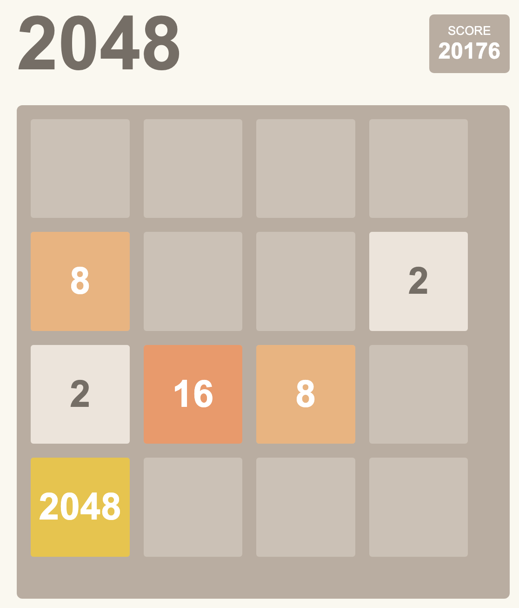

# 2048 Game

A modern implementation of the classic 2048 puzzle game built with vanilla JavaScript, HTML, and CSS. This version features smooth animations, an undo function, and the ability to continue playing after winning.

## Features

- 🎮 Classic 2048 gameplay mechanics
- ↩️ Undo move functionality
- 🏆 Continue playing after reaching 2048
- 🎯 Score tracking

## How to Play

1. Use arrow keys (↑ ↓ ← →) to move tiles
2. When two tiles with the same number touch, they merge into one
3. Create a tile with the number 2048 to win
4. If you can't make a move, the game is over

### Controls
- **Arrow Keys**: Move tiles
- **Undo Button**: Revert last move
- **Keep Going**: Continue playing after winning
- **Try Again**: Start a new game

## Technical Implementation

The game is built using:
- Vanilla JavaScript for game logic
- CSS Grid for the game board
- CSS transforms for smooth animations
- Modern ES6+ features

### Key Components

- `game.js`: Core game logic and state management
- `styles.css`: Game styling and animations
- `index.html`: Game structure and layout

## Local Development

1. Clone the repository
2. Open `index.html` in your browser
3. No build process required - it's all vanilla JavaScript!

## Contributing

Feel free to submit issues and pull requests for:
- New features
- Bug fixes
- Performance improvements
- Documentation updates

